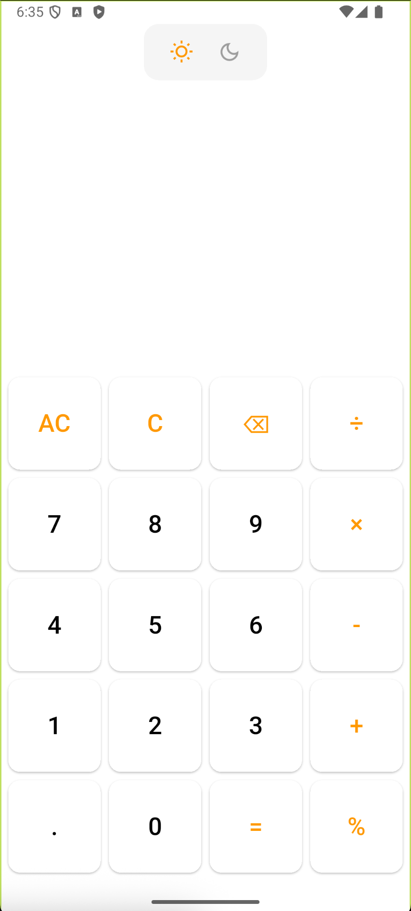
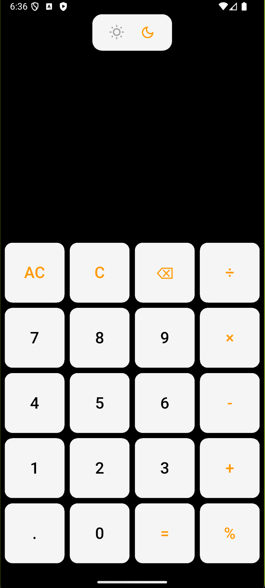

# Calculator App

A simple Flutter calculator app that supports basic arithmetic operations with light and dark theme switching.

## Prerequisites

1. Flutter SDK (Install Flutter https://docs.flutter.dev/get-started/install)
2. A code editor → VS Code / Android Studio / IntelliJ

## Installation

git clone https://github.com/anshgupta2403/calculator_app.git

## Features

✅ Basic calculator operations: addition, subtraction, multiplication, division and modulus  
✅ Responsive design for mobile  
✅ Switch between dark and light theme  
✅ Clean and minimal UI

## Theme Support

1. Light Theme: Bright background, dark text.
2. Dark Theme: Dark background, light text.
3. You can toggle the theme from the top.

## How to Run

1. cd calculator_app
2. flutter pub get
3. flutter run

## Screensshots

### Light Theme

<table>
  <tr>
    <td></td>
  </tr>
</table>

### Dark Theme

<table>
  <tr>
    <td></td>
  </tr>
</table>

